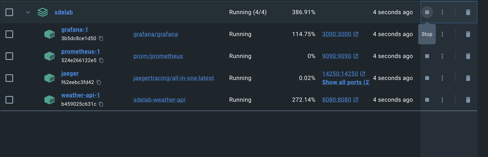
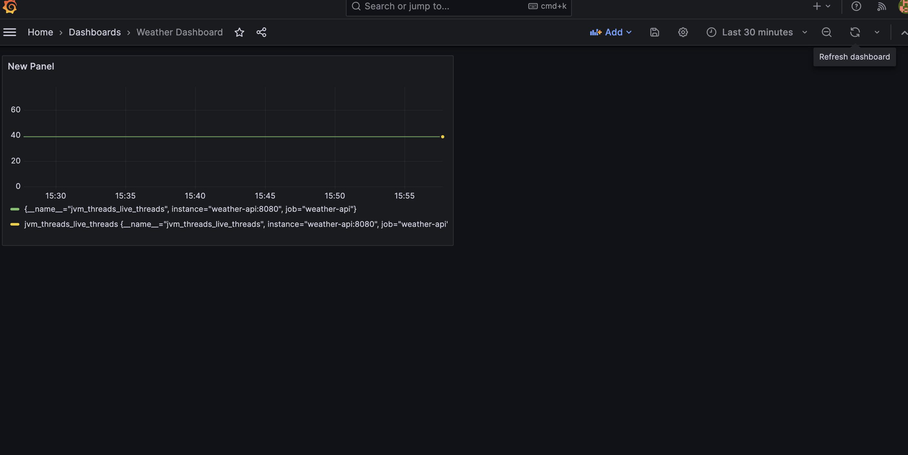

# Springboot Weather API

## Introduction

This Spring Boot application utilizes a third-party API to fetch weather data. The project is developed for learning purposes and includes various features to showcase different aspects of Spring Boot development.

## Table of Contents

- [Introduction](#introduction)
- [Table of Contents](#table-of-contents)
- [Features](#features)
- [Steps to Run Locally](#steps-to-run-locally)
- [Swagger](#swagger)
- [Open telemetry](#opentelemetry)
- Prometheus
- Grafana
- Actuator
- Jaeger

## Features

1. **Reactive Programming (Webclient)**

2. **Caching (Webclient)**

3. **Distributed Tracing (Jaeger)**
    - Integration of Jaeger for distributed tracing.

4. **Prometheus**

5. **Grafana**

6. **Exception Handling using Advice**

7. **Swagger**
    - Integration of Swagger for API documentation.

8. **Dockerization**

9. **Retry Mechanism**

10. **Data Validation**
    - How data validation is handled within the application.

## Steps to run locally

1. Clone the repo
2. Start Docker locally in your computer
3. Run the command "docker-compose up" in the root of project
4. Now the weather-api application should be available on port 8080. Try hitting http://localhost:8080/actuator/health in your browser.

In docker desktop you can see the following containers running

## Swagger

You can see the swagger by visiting http://localhost:8080/swagger-ui/index.html#/ in your browser.

You can import the postman collection given in docs folder and that will you gave all the end points available.

## Opentelemetry

